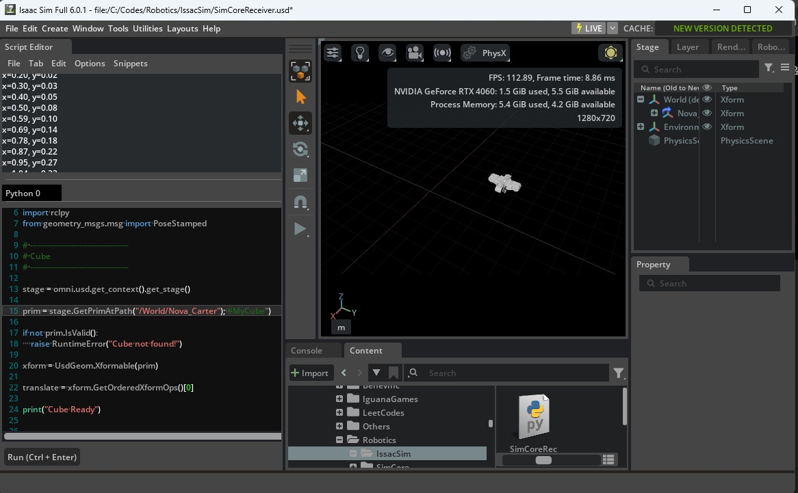




# SimCore

A lightweight robotics simulation core for AGV and mobile robot development.

<p align="left">
  
</p>

## Overview

SimCore is a C++ robotics simulation engine that communicates through ROS2, allowing visualization and integration with multiple robotics simulators and applications.

Current visualization target:

- NVIDIA Isaac Sim 6.0

Future targets:

- RViz
- Custom Fleet Manager
- Physical AGV

---

# Architecture

```
+---------------------+
|     SimCore         |
|  (C++ Simulation)   |
+----------+----------+
           |
           | Internal API
           |
+----------v----------+
|   simcore_bridge    |
|    ROS2 Bridge      |
+----------+----------+
           |
           | PoseStamped
           |
+----------v----------+
|    NVIDIA Isaac     |
|      Python         |
+----------+----------+
           |
           |
      USD Prim Update
           |
           |
        Robot Model
```

---

# Technology Stack

## Core

- C++20
- CMake

## Communication

- ROS2 Jazzy
- geometry_msgs
- tf2

## Visualization

- NVIDIA Isaac Sim 6.0
- Python
- USD
- OmniKit

---

# Current Features

- AGV simulation core
- Robot pose publisher
- Goal publisher
- TF publisher
- Marker publisher
- ROS2 Bridge

---

# Milestones

## Milestone 1 ✅

Real-time visualization in NVIDIA Isaac Sim.

Completed features:

- SimCore publishes robot pose
- ROS2 Bridge transfers PoseStamped
- Isaac Sim subscribes to ROS2 topic
- Python callback updates USD transform
- Cube visualization follows SimCore robot in real time

Result:

```
SimCore
    │
ROS2
    │
Isaac Sim
    │
Moving Cube
```

Status:

**Completed**

---

## Milestone 2 (Next)

Replace cube with a mobile robot model.

Goals

- Nova Carter visualization
- Robot orientation support
- Cleaner bridge architecture

---

## Milestone 3

Visualization Features

- Goal
- Planned Path
- Obstacles
- Robot Footprint
- Robot Trajectory

---

## Milestone 4

Sensor Visualization

- LiDAR
- Camera
- Depth Camera
- Semantic Camera

---

# Future Roadmap

- Digital Twin
- Fleet Visualization
- Multi-Robot Simulation
- Isaac Lab Integration
- Physical Robot Integration

---

# Repository Structure

```
simcore/
    core/

simcore_bridge/
    ROS2 Bridge

isaac_bridge/
    Python Visualization
```

---

# Current Status

✅ ROS2 communication

✅ Isaac Sim integration

✅ Real-time robot visualization

🚧 Robot model replacement

🚧 Multi-robot support

🚧 Sensor visualization


# License

This project is intended for educational and personal learning purposes.
